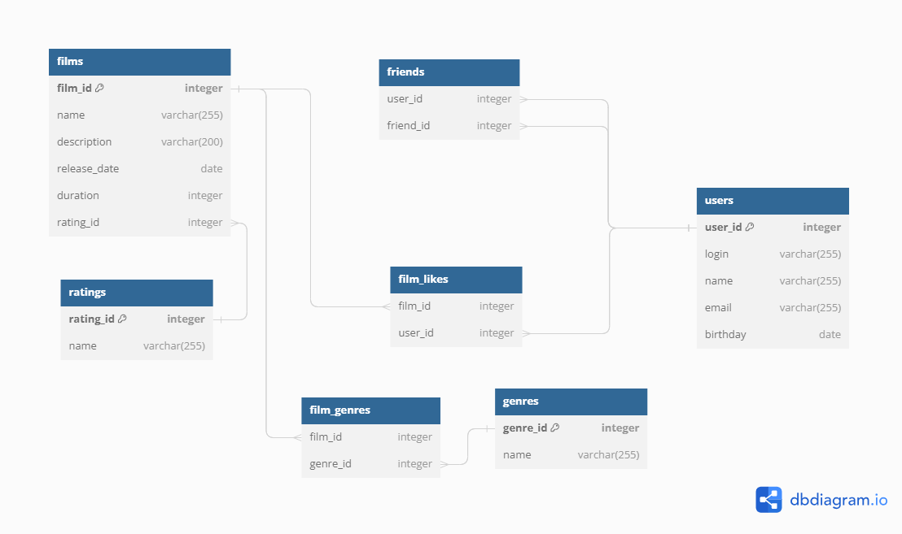

# java-filmorate

Template repository for Filmorate project.

## Filmorate database scheme



### Примеры запросов:

1. Получение списка всех пользователей:

``` sql
SELECT * FROM users;
```

2. Получение 10 фильмов с наибольшим числом лайков:

``` sql
SELECT f.film_id, 
f.name, 
f.description, 
f.release_date, 
f.duration, 
f.rating_id
FROM films as f 
LEFT JOIN film_likes as fl on f.film_id = fl.film_id
GROUP BY f.film_id 
ORDER BY COUNT(fl.user_id) desc 
LIMIT 10;
```

3. Получение списка друзей пользователя c id=1:

``` sql
SELECT * FROM users as u 
JOIN friends as f ON u.user_id = f.friend_id
WHERE f.user_id = 1;
```